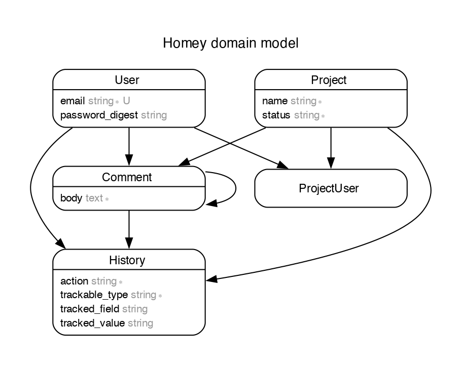

# Homey App

[Task for Homey](https://allentities.notion.site/Task-Development-Team-d5aae74100544f84981972edb3d922b0).

Use Ruby on Rails to build a project conversation history. A user should be able to:

- leave a comment
- change the status of the project

The project conversation history should list comments and changes in status.

<!-- TOC start -->

- [Assumptions](#assumptions)
- [My Thought Process](#my-thought-process)
- [Domain Model](#domain-model)
- [Prerequisites](#prerequisites)
- [Installation](#installation)
  - [With Docker](#with-docker)
  - [Without Docker](#without-docker)
  - [Database creation](#database-creation)
  - [Run Test Suite](#run-test-suite)
- [TODO](#todo)

<!-- TOC end -->

<!-- TOC --><a name="assumptions"></a>

## Assumptions

Some assumptions I made:

- All users can see all projects (does not need to be logged in to see projects)
- All users can comment on all projects (must be logged in to comment)
- Only a user associated with a project can change the status of a project
- The project index page will show all projects and their status
- A project's show page will show all comments and status changes (ConversationHistory)

<!-- TOC --><a name="my-thought-process"></a>

## My Thought Process

In tackling this task, apart from delivering and MVP, I was determined to showcase some
best practices including

- Object Oriented Design
- Polymorphism
- Testing with rspec
- Linting with rubocop
- Design patterns
  - Used form objects to create records. This added an extra layer security and control.

Frontend

- Tailwind for styling.
- turbo stream/frames.

And more.

Following the guide to get the app running and take it for a spin.

<!-- TOC --><a name="domain-model"></a>

## Domain Model



<!-- TOC --><a name="prerequisites"></a>

## Prerequisites

This project requires:

- Ruby `3.2.2`, use your favourite version manager to install this.
  I use [asdf](https://asdf-vm.com/)
- Rails `7.2.1`
- [Docker](https://www.docker.com/) (Optional, see alternative below)
- [docker compose](https://docs.docker.com/compose/install/) (Optional, see alternative below)

Alternatively, if you do not have docker on your machine, you will need the following:

- PostgreSQL must be installed and accepting connections
- Redis must be installed

<!-- TOC --><a name="installation"></a>

## Installation

Clone this repo

```sh
$ git clone git@github.com:genzade/homey.git
$ cd homey
$ bundle
```

<!-- TOC --><a name="with-docker"></a>

### With Docker

Start the daemon

```sh
$ docker compose up -d
```

Run the servers with:

```sh
$ bin/dev
```

<!-- TOC --><a name="without-docker"></a>

### Without Docker

Start redis server

```sh
$ redis-server
```

Start sidekiq server

```sh
$ bundle exec sidekiq
```

Start application server

```sh
$ bin/rails server
```

<!-- TOC --><a name="database-creation"></a>

### Database creation

```sh
$ bin/rails db:drop db:create db:migrate db:seed
```

<!-- TOC --><a name="run-test-suite"></a>

### Run Test Suite

```sh
$ bundle exec rspec
```

<!-- TOC --><a name="todo"></a>

## TODO

- [ ] Better styling of the application.
- [ ] Some system specs are not passing, TurboFrames may be the culprit some tweaking
- [ ] required.
- [ ] Comments make comments replyable. Comment are already self-referential but
- [ ] needs to be hooked up on the frontend
- [ ] Admin users? at the moment all users are the same.
- [ ] Add some authorisation. (CanCanCan or Pundit gem?)
